### Resources
https://www.hellointerview.com/learn/system-design/core-concepts/networking-essentials

### The Big Picture

                         YOUR APPLICATION
                               │
            ┌──────────────────┼──────────────────┐
            │                  │                  │
        REST API          GraphQL API          gRPC
            │                  │                  │
     Architectural        Query language      RPC framework
        style             + runtime              │
            │                  │              Protobuf
            │                  │          serialization/schema
            └──────── HTTP ────┘                  │
                     │                         HTTP/2
                     │                            │
                     └──────────┬─────────────────┘
                                │
                    ┌───────────┴───────────┐
                    │                       │
                   TCP                     UDP
              reliable stream          datagrams
                    │                       │
                    └───────────┬───────────┘
                                │
                                IP
                                │
                               NETWORK

### OSI Model
┌─────────────────────────────────────────────┐
│ Layer 7 — APPLICATION                       │
│ HTTP, DNS, SMTP                             │
│ REST / GraphQL / gRPC concepts live here   │
├─────────────────────────────────────────────┤
│ Layer 6 — PRESENTATION                      │
│ Encoding, encryption, compression           │
├─────────────────────────────────────────────┤
│ Layer 5 — SESSION                           │
│ Session management                          │
├─────────────────────────────────────────────┤
│ Layer 4 — TRANSPORT                         │
│ TCP / UDP                                   │
├─────────────────────────────────────────────┤
│ Layer 3 — NETWORK                           │
│ IP                                          │
├─────────────────────────────────────────────┤
│ Layer 2 — DATA LINK                         │
│ Ethernet / Wi-Fi frames / MAC               │
├─────────────────────────────────────────────┤
│ Layer 1 — PHYSICAL                          │
│ Cable / fiber / radio / electrical signals  │
└─────────────────────────────────────────────┘

#### The three layers you should remember most strongly for system design:
L7 → Application → HTTP
L4 → Transport   → TCP / UDP
L3 → Network     → IP


#### IP vs TCP vs HTTP
HTTP
"What are the applications saying?"
             │
             ▼
TCP
"How do I deliver it reliably?"
             │
             ▼
IP
"Where does it need to go?"

#### TCP vs UDP
                    Layer 4
                       │
             ┌─────────┴─────────┐
             │                   │
            TCP                 UDP
             │                   │
        Connection          Connectionless
        Reliable            Best effort
        Ordered             No ordering guarantee
        Retransmit          No built-in retransmit

#### TCP
Think:

> **"Make sure the data arrives correctly and in order."**

**Typical uses:**
Web traffic (HTTP/1.1, HTTP/2)
Database connections
Email
File transfer
SSH

#### UDP
Think:

> **"Send the datagram without TCP's reliability machinery."**

**Typical uses:**
DNS
DHCP
WebRTC media
Online gaming
Real-time communication
QUIC / HTTP/3

**Important:**
UDP ≠ applications can never be reliable
HTTP/3
   ↓
 QUIC ← implements reliability etc.
   ↓
 UDP
   ↓
   IP

#### HTTP
HTTP is an **application-layer protocol**.

HTTP
│
├── Methods
│     ├── GET
│     ├── POST
│     ├── PUT
│     └── DELETE
│
├── Headers
│
├── Request body
│
├── Response body
│
└── Status codes
      ├── 200
      ├── 404
      └── 500

HTTP/1.1 → TCP → text-based requests/responses
HTTP/2   → TCP → multiplexed streams + binary framing
HTTP/3   → QUIC → UDP + multiplexed streams


**HTTP evolved mainly to improve:**
- Connection reuse
- Concurrency
- Latency
- Network efficiency
- Handling packet loss

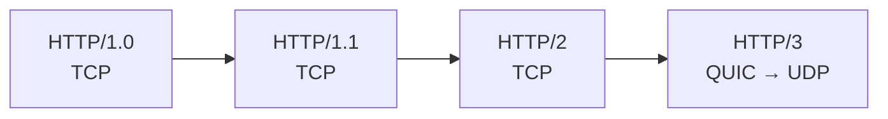

| Version  | Main Idea               |
| -------- | ----------------------- |
| HTTP/1.0 | New connection          |
| HTTP/1.1 | Reuse connection        |
| HTTP/2   | Multiplex over TCP      |
| HTTP/3   | Multiplex over QUIC/UDP |
##### 1. HTTP/1.0

HTTP/1.0 commonly followed this model:

> **Request → Response → Connection closes**

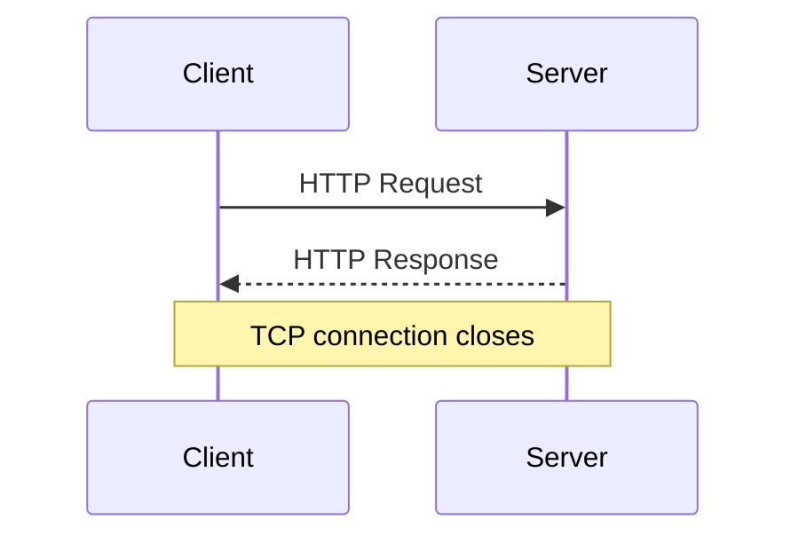

If a webpage needs multiple resources:

- HTML → TCP connection → response → close
- CSS → new TCP connection → response → close
- JavaScript → new TCP connection → response → close
- Image → new TCP connection → response → close
##### Main Problem
Creating a new TCP connection repeatedly adds overhead.
So the main idea is:

> **HTTP/1.0 = typically one request/response per TCP connection**

##### 2. HTTP/1.1

HTTP/1.1 introduced **persistent connections**.

Instead of closing the TCP connection after every response, the connection can be reused.

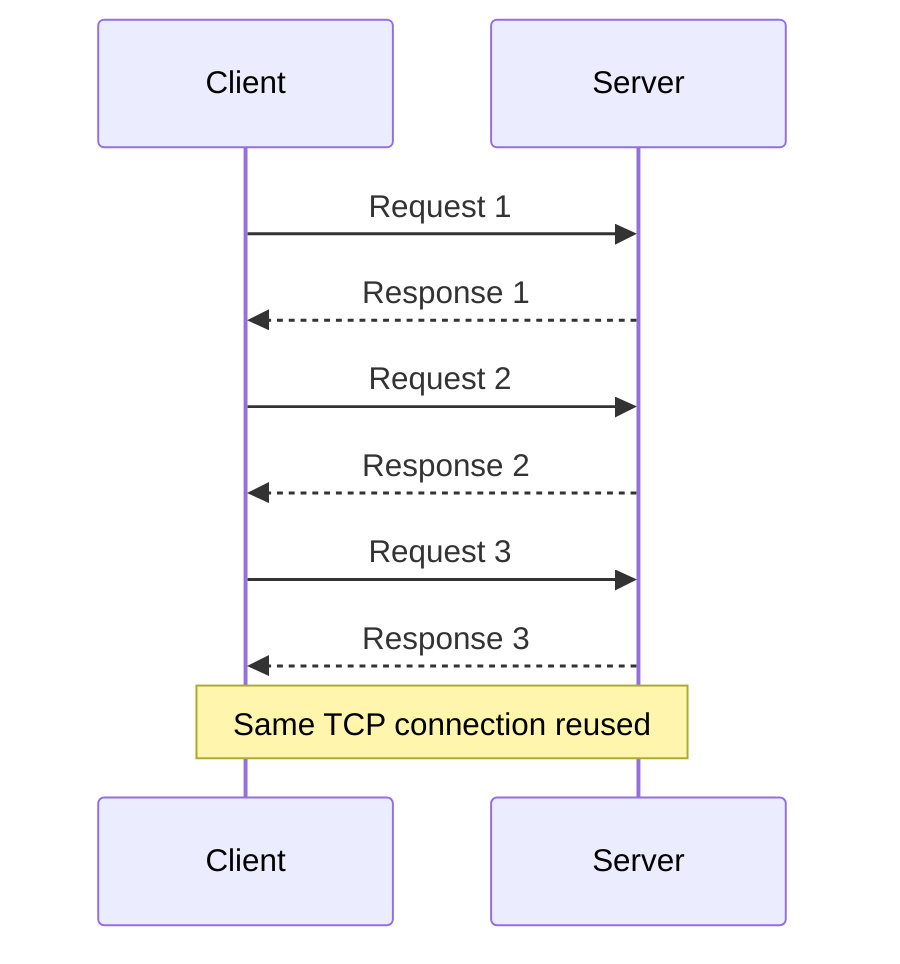

This is often called:

> **Persistent connection / Keep-Alive**

> **HTTP/1.1 = reuse the TCP connection**

**Main HTTP/1.1 Limitation**

HTTP/1.1 does **not provide true multiplexing** on a single connection.
HTTP/1.1 defined **pipelining**, where multiple requests could be sent before receiving the previous responses.
However, responses still had to be returned in order.

Example:
- Request A → slow
- Request B → ready
- Request C → ready

B and C may still be stuck behind A.

This is called:
> **HTTP-level Head-of-Line (HOL) blocking**

Because of this, browsers commonly opened multiple TCP connections to the same server.

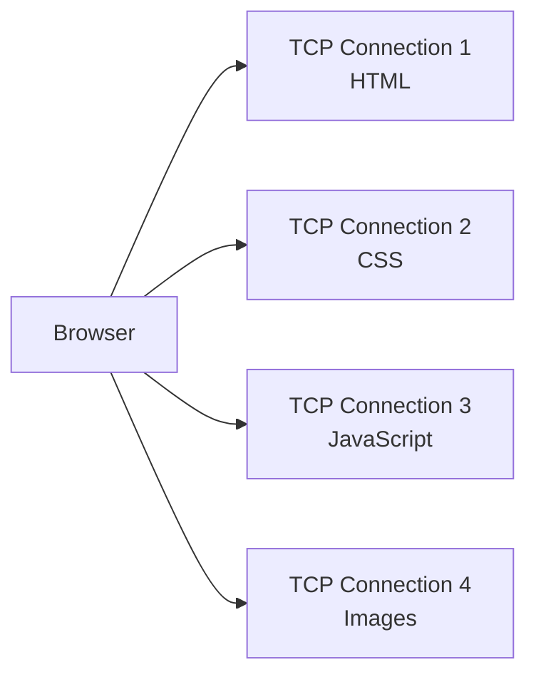

**Key Point**
> **HTTP/1.1 = persistent connections, but no true multiplexing**


3. HTTP/2

The biggest improvement in HTTP/2 is:

> **Multiplexing**

Multiple HTTP requests and responses can share **one TCP connection simultaneously**.

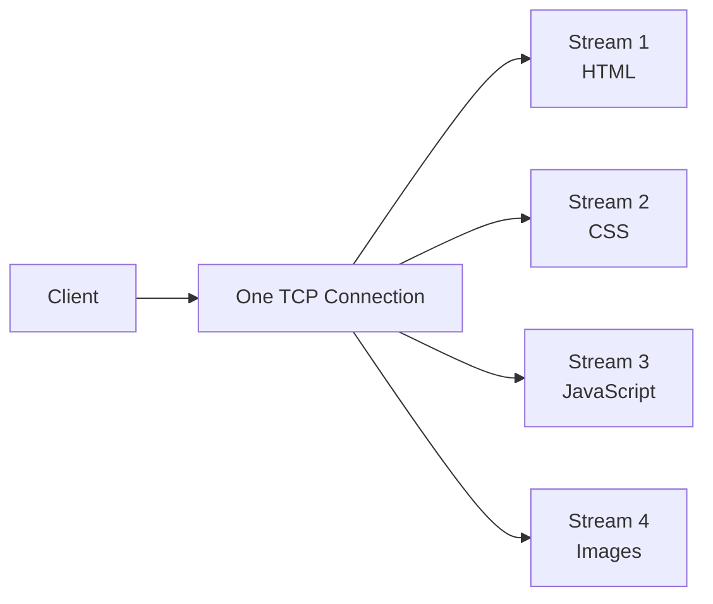

Instead of:

- TCP connection 1 → HTML
- TCP connection 2 → CSS
- TCP connection 3 → JavaScript

HTTP/2 can use:

- One TCP connection
  - Stream 1 → HTML
  - Stream 2 → CSS
  - Stream 3 → JavaScript
  - Stream 4 → Images

**What Is Multiplexing?**

HTTP/2 breaks communication into **frames**.
Frames from different streams can be interleaved.
For example:
```text
HTML-1
CSS-1
JS-1
HTML-2
CSS-2
JS-2
```

Each frame contains information identifying which HTTP/2 stream it belongs to.
Therefore multiple requests can make progress at the same time.

**Header Compression**

HTTP requests repeatedly send headers such as:
- Host
- User-Agent
- Accept
- Cookie
- Authorization

HTTP/2 uses:

> **HPACK**

to compress HTTP headers and reduce repeated data.

**HTTP/2 Server Push**

HTTP/2 also introduced **Server Push**.
The idea was:
1. Client requests `index.html`
2. Server sends `index.html`
3. Server proactively sends `style.css`

However, HTTP/2 Server Push had limited practical usefulness, and major browsers later removed/deprecated support.
For interviews:

> Server Push was introduced with HTTP/2, but it is not a major modern HTTP/2 advantage.

**HTTP/2 Problem: TCP Head-of-Line Blocking**

HTTP/2 solved HTTP-level multiplexing.
However, HTTP/2 still runs over **TCP**.

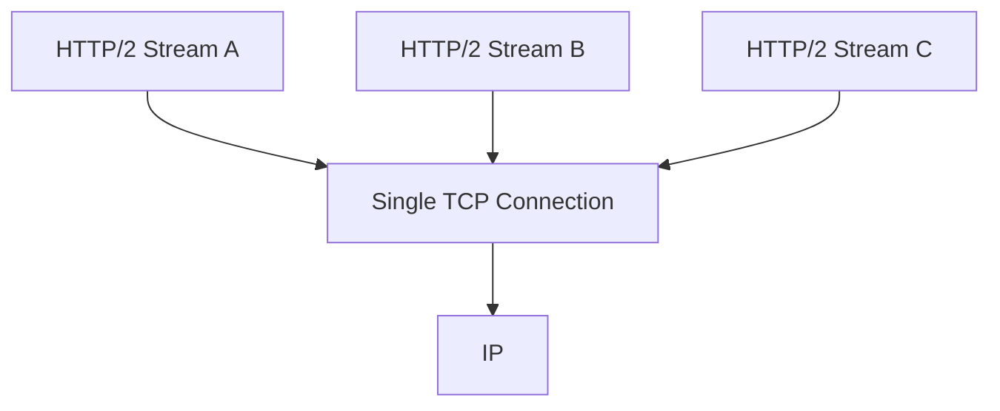

TCP guarantees:

> **Reliable and ordered byte delivery**

Suppose TCP receives:

- Packet 1 ✅
- Packet 2 ✅
- Packet 3 ❌ Lost
- Packet 4 ✅
- Packet 5 ✅

TCP must recover the missing data before it can deliver later bytes in order.
Because all HTTP/2 streams share the same TCP connection, packet loss can delay multiple streams.
This is called:

> **TCP-level Head-of-Line blocking**

This became one of the major motivations for HTTP/3.

##### HTTP/3

HTTP/3 makes a major transport-layer change.
HTTP/1.0, HTTP/1.1 and HTTP/2 use TCP.
HTTP/3 uses:

> **QUIC over UDP**

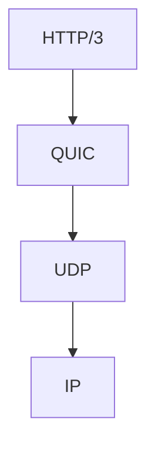

Compare:

| HTTP Version | Transport |
|---|---|
| HTTP/1.0 | TCP |
| HTTP/1.1 | TCP |
| HTTP/2 | TCP |
| HTTP/3 | QUIC over UDP |

**What Is QUIC?**

QUIC is a modern transport protocol that runs over UDP.
UDP itself does not provide TCP-style reliability.
QUIC builds the required functionality on top of UDP.
QUIC provides features such as:
- Reliable delivery
- Congestion control
- Multiplexed streams
- Encryption
- Connection management

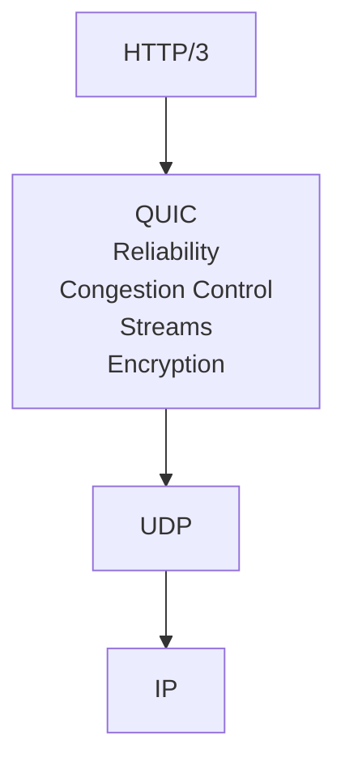

Therefore:

> **HTTP/3 is not unreliable just because UDP is underneath it.**

QUIC implements the reliability that HTTP/3 needs.

**Why HTTP/3 Helps With Head-of-Line Blocking**

HTTP/2 has multiple streams:

```text
Stream A
Stream B
Stream C
```

but they all depend on one TCP byte stream.
With HTTP/3, QUIC manages independent streams.

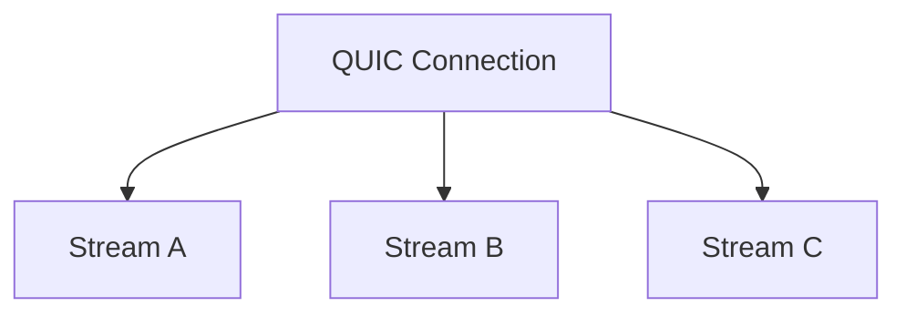

Suppose data belonging to Stream B is lost:

- Stream A → can continue
- Stream B → waits for its missing data
- Stream C → can continue

So:

> **HTTP/3 avoids TCP's cross-stream Head-of-Line blocking.**

**Important:**
The affected stream can still wait for its own missing data.
HTTP/3 does not magically remove all waiting.

**HTTP/3 and TLS**

Traditional HTTPS over TCP conceptually looks like:

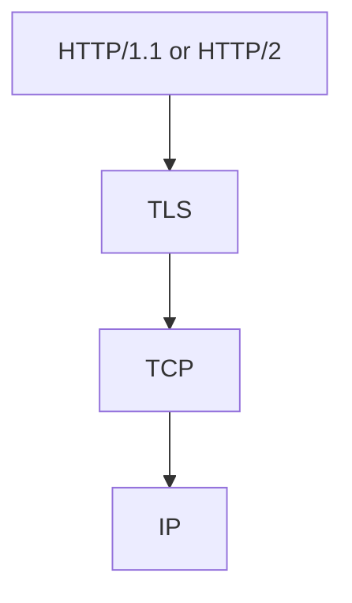

QUIC integrates **TLS 1.3** into the protocol.

HTTP/3 therefore looks like:

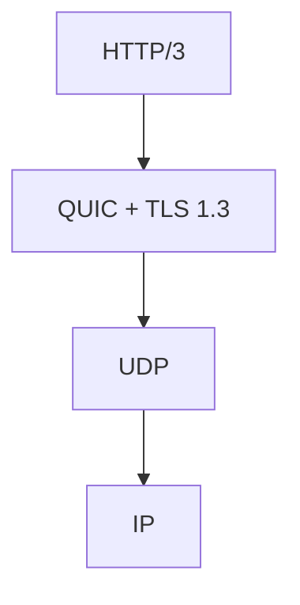

This helps reduce connection-establishment latency.

##### HTTP/1.0 vs HTTP/1.1 vs HTTP/2 vs HTTP/3

| Feature              | HTTP/1.0   | HTTP/1.1 | HTTP/2         | HTTP/3                       |
| -------------------- | ---------- | -------- | -------------- | ---------------------------- |
| Transport            | TCP        | TCP      | TCP            | QUIC over UDP                |
| Connection reuse     | Usually No | Yes      | Yes            | Yes                          |
| Multiplexing         | No         | No       | Yes            | Yes                          |
| Binary framing       | No         | No       | Yes            | Yes                          |
| Header compression   | No         | No       | HPACK          | QPACK                        |
| HTTP-level HOL       | Yes        | Yes      | Largely solved | Largely solved               |
| TCP cross-stream HOL | —          | —        | Yes            | No TCP                       |
| TLS                  | Separate   | Separate | Usually TLS    | TLS 1.3 integrated with QUIC |
| Connection migration | No         | No       | No             | Yes                          |

### REST
REST is **NOT a protocol**.
It is an **architectural style for designing APIs**.

HTTP = communication protocol
REST = API design principles

REST thinks primarily in terms of **resources**:

### GraphQL

GraphQL is an **API query language + runtime**.

Its big idea:
> **The client specifies exactly which fields it wants.**

**REST:**
GET /users/101
Server decides response shape.

**GraphQL:**
query {
  user(id: 101) {
    name
    email
  }
}

Response:
{
  "data": {
    "user": {
      "name": "Shivam",
      "email": "..."
    }
  }
}

GraphQL commonly exposes something like:
POST /graphql

### gRPC
gRPC is an **RPC framework**.
RPC = **Remote Procedure Call**.

**Instead of thinking**: GET /users/101
**you think:** GetUser(101)

**gRPC commonly uses:**
gRPC
  │
  ├── Protobuf
  │
  └── HTTP/2
         │
        TCP
         │
         IP
**Protobuf:**
**Protocol Buffers** is a schema + binary serialization mechanism.
**Example .proto file**
message User {
    int32 id = 1;
    string name = 2;
    string email = 3;
}

### REST vs GraphQL vs gRPC
REST
   │
   └── Think RESOURCES

       GET /users/101
GraphQL
   │
   └── Think DATA

       user(id:101) {
           name
           email
       }
gRPC
   │
   └── Think FUNCTIONS / METHODS

       GetUser(101)

### Server-Sent Events (SSE)

SSE allows the server to maintain an HTTP connection and **continuously push events to the client**.

**Normal HTTP:**
Client ─── request ───► Server
Client ◄── response ─── Server

**SSE:**
Client ─── connect ───► Server

Client ◄── event 1 ──── Server
       ◄── event 2 ────
       ◄── event 3 ────
       ◄── event 4 ────

       connection stays open

SSE is primarily:
SERVER ─────────► CLIENT

**Typical use cases:**
Notifications
Job progress
Live dashboards
News feeds
Streaming generated output
Status updates

### Polling vs SSE vs WebSocket

**Polling:**
Client ──► Any update?
Client ◄── No

Client ──► Any update?
Client ◄── No

Client ──► Any update?
Client ◄── Yes

**SSE:**
Client ───── connect ─────► Server

Client ◄── update ───────── Server
       ◄── update ─────────
       ◄── update ─────────

**WebSocket:**
Client ◄══════════════════► Server

### WebRTC
WebRTC is designed for **real-time audio, video, and data communication**.

**Typical uses:**
Video calls
Voice calls
Screen sharing
P2P data
Video conferencing

**Architecture:**
```
Alice          Signaling Server          Bob
  │                   │                   │
  ├─ connection info ─►                   │
  │                   ├─ connection info ─►
  │                   │                   │
  │◄──────────── WebRTC media/data ───────►
```

**Four important concepts:**

| Component | Role                                 |
| --------- | ------------------------------------ |
| **SDP**   | Describe session / capabilities      |
| **ICE**   | Find a working network path          |
| **STUN**  | Discover public-facing connectivity  |
| **TURN**  | Relay traffic when direct path fails |

**Easy memory:**

SDP  → What/how can we communicate?
ICE  → Which network path works?
STUN → How am I visible from outside?
TURN → Can't connect directly? Relay it.

### SSE vs WebSocket vs WebRTC

| | SSE | WebSocket | WebRTC |
| --- | --- | --- | --- |
| **Main direction** | Server → Client | Client ↔ Server | Peer ↔ Peer |
| **Main use** | Updates | Messaging | Audio/video/data |
| **Real-time** | Yes | Yes | Yes |
| **Audio/video optimized** | No | No | Yes |
| **Typical example** | Job progress | Chat | Video call |

### Layer 4 vs Layer 7 load balancers

                    LOAD BALANCER
                          │
              ┌───────────┴───────────┐
              │                       │
             L4                      L7
              │                       │
        TCP / UDP level          HTTP level
              │                       │
       IP / port / flow       URL / Host / Headers

**Layer 4 Load Balancer (Transport layer)**  
Sees only IP addresses and ports — TCP/UDP connection info. It has **no idea what's inside the packet** (no idea if it's HTTP, a database query, anything). It just says "this connection needs a home" and forwards raw packets to a backend, keeping the same connection open end-to-end. Very fast, low overhead, protocol-agnostic — works for HTTP, but also for things that aren't HTTP at all (raw TCP services, databases, game servers).

**Layer 7 Load Balancer (Application layer)**  
Actually **terminates and reads the HTTP request** — it can see the URL path, headers, cookies, hostname, method. This lets it make smart, content-aware routing decisions: send `/api/*` to one backend, `/images/*` to another; route `api.example.com` and `www.example.com` (different hostnames on the same IP) to completely different services; inspect a cookie to keep a user pinned to the same backend (session affinity); do things like SSL termination, request/response header rewriting, or even return a response directly (like a redirect) without ever touching a backend.

**One line each, side by side:**
- L4 → sees only IP:port, blind to content, fastest, works for any TCP/UDP traffic
- L7 → reads the actual HTTP request, can route by path/host/header, more flexible but more overhead

**Rule of thumb for when to use which:** if you just need to spread traffic across identical backend instances, L4 is enough and cheaper. If you need path-based routing, host-based routing, or anything that depends on understanding the request itself, you need L7.

### All In One Diagram

                         USERS
                           │
                     Internet
                           │
                           ▼
                   ┌─────────────┐
                   │   L4 LB     │
                   │ TCP / UDP   │
                   └──────┬──────┘
                          │
                          ▼
                   ┌─────────────┐
                   │   L7 LB     │
                   │ HTTP/HTTPS  │
                   └──────┬──────┘
                          │
              ┌───────────┼────────────┐
              │           │            │
           /users      /orders     /payments
              │           │            │
              ▼           ▼            ▼
          User Svc    Order Svc    Payment Svc
              │           │            │
              └───────────┼────────────┘
                          │
                    Internal APIs
                          │
             ┌────────────┼─────────────┐
             │            │             │
           REST        GraphQL         gRPC
             │            │             │
            JSON         JSON        Protobuf
             │            │             │
            HTTP         HTTP         HTTP/2
                                        │
                                       TCP
                                        │
                                       IP


                  "WHAT kind of API?"
                         │
              ┌──────────┼──────────┐
             REST     GraphQL      gRPC
              │          │           │
              └──── HTTP │        HTTP/2
                         │           │
                         └─────┬─────┘
                               ▼
                        "HOW transport?"
                               │
                         ┌─────┴─────┐
                        TCP         UDP
                         │           │
                         └─────┬─────┘
                               ▼
                       "WHERE does it go?"
                               │
                              IP
                               │
                            Network


              "Need continuous communication?"
                               │
             ┌─────────────────┼────────────────┐
             ▼                 ▼                ▼
            SSE            WebSocket         WebRTC
      Server → Client    Client ↔ Server    Peer ↔ Peer


### The physical network layout (where things live)

**Region** is a city. It's a geographic area like Mumbai, Hyderabad, Frankfurt, or Ashburn, and each region runs mostly independently. If one region has a problem, others shouldn't be affected.

**Availability Domain (AD)** is a separate building in that city. It's one or more data centers with their own power, cooling, and network, so a fire or power cut in one AD shouldn't take down another. Some regions have 3 ADs; many have just 1.

**Fault Domain (FD)** is a separate floor inside the building. Each AD is split into 3 fault domains, which are groups of hardware (racks, power, switches) that don't share a single point of failure. If one rack's switch dies, only one FD is hit.

So it nests like this:

```
Region (city)
 └── Availability Domain (building)
      └── Fault Domain (floor / group of racks)
```

**Why this matters for your job:** this is your **blast radius** vocabulary. When you roll out a patch to network devices, you never touch everything at once. You go one fault domain at a time, then one AD, then one region, checking health between each step. Saying "I'd roll out FD by FD, AD by AD, region by region with health gates" in the interview shows you speak OCI's language.


### The virtual layer 

#### **VCN (Virtual Cloud Network)** 
Its a customer's own private network inside OCI, like a private gated society. It's like your home Wi-Fi network, but in the cloud. Customers pick an IP range for it (e.g., 10.0.0.0/16).

#### **Subnet** 
A **subnet** is a smaller, carved-out slice of your VCN's overall CIDR block — a way of splitting one big address range into separate compartments so you can control and isolate resources differently within each one.

**Why you'd split at all**
Your VCN might be `10.0.0.0/16` (65,536 addresses). You don't dump every resource — web servers, app servers, databases — into that one flat pool. You divide it into subnets like `10.0.1.0/24` and `10.0.2.0/24`, and put different kinds of resources in different subnets, because each subnet can be given **different rules**.

**What actually differs between subnets**
Each subnet has its own:
- **Route table** — decides where its traffic goes (out to the internet via IGW, out via NAT, kept local, etc.) — this is literally what makes one subnet "public" and another "private," as covered earlier.
- **Security lists / NSGs** — what traffic is allowed in/out at that layer.
- **Availability Domain / zone placement** (in most clouds, a subnet lives in one AD/AZ) — so spreading resources across multiple subnets in different ADs is how you build for fault tolerance.

**Typical pattern**
- **Public subnet** — route table sends `0.0.0.0/0` → Internet Gateway. Holds things that genuinely need to be reachable from the internet: load balancers, bastion hosts.
- **Private subnet** — route table sends `0.0.0.0/0` → NAT Gateway. Holds things that should never be directly internet-reachable but still need outbound access: app servers, databases.

**One line summary:** a VCN is the whole property; a subnet is one fenced-off yard within it, each yard with its own gate rules (route table) and guard rules (security list) — so you don't have to apply the same access policy to everything you own.

#### **Gateways** 
They are the doors in and out:
**Internet Gateway (IGW)**  
A door that allows traffic **both ways** — resources in a public subnet can initiate connections out to the internet, _and_ the internet can initiate connections in to them (if a route + security rule allows it). This is what gives an instance a real public IP presence. Attach one to your VCN, add a route pointing `0.0.0.0/0` at it, and that subnet becomes "public."

**NAT Gateway**  
A door that only allows traffic **one way** — private instances can reach _out_ (say, to download OS patches or hit an external API), but nothing outside can _initiate_ a connection back in. It works by translating the private instance's internal IP to the NAT Gateway's own public IP for outbound requests, then routing the response back to the right instance when it comes back. This is the standard pattern for app/db servers that need internet access for updates but should never be directly exposed.

**DRG (Dynamic Routing Gateway)**  
The door for **private, non-internet connectivity** — connecting your VCN to something that isn't "the public internet" at all: your company's on-prem office network (via VPN or FastConnect/Direct Connect equivalent), or another VCN entirely (via remote peering). Unlike the IGW/NAT, it's not about internet access — it's about extending your private network to another private network, so traffic never has to touch the public internet.

**Security Lists / Network Security Groups** are the security guards. They are firewall rules saying who can talk to whom.

#### **CIDR block** 
(Classless Inter-Domain Routing) is a way of specifying a range of IP addresses using a compact notation: `<base IP>/<prefix length>`, e.g. `10.0.0.0/16`.

**How the notation works**

The number after the slash tells you how many bits (from the left) of the IP address are fixed as the "network" portion — the rest are free to vary as "host" addresses within that block.

- `/16` → first 16 bits fixed, last 16 bits variable → 2¹⁶ = 65,536 addresses (`10.0.0.0` – `10.0.255.255`)
- `/24` → first 24 bits fixed, last 8 bits variable → 2⁸ = 256 addresses (`10.0.1.0` – `10.0.1.255`)
- `/32` → all bits fixed → exactly 1 address (used to refer to a single host)

**Where you actually encounter it day to day**

- **Cloud networking (AWS VPC, GCP VPC, Azure VNet)** — when you create a VPC you assign it a CIDR block (e.g. `10.0.0.0/16`), then subdivide it into subnets, each their own smaller CIDR block. This determines how many private IPs are available to your resources and how your network is segmented (public subnet vs private subnet, per-AZ subnets, etc.).
- **Firewall/security group rules** — "allow traffic from `203.0.113.0/24`" restricts access to that specific IP range rather than one address or the whole internet (`0.0.0.0/0`).
- **Routing tables** — a route like `10.0.0.0/16 → local` tells the router which traffic stays inside the VPC versus what needs to go out to the internet gateway.


#### **Route Table** 
A **route table** is basically a signpost — a list of rules that says: "if traffic is headed to this destination range, send it out this way."

**How it works, simply**
Each entry (route) has two parts:

- **Destination** — a CIDR block (e.g. `10.0.0.0/16` or `0.0.0.0/0` for "anything")
- **Target** — where to send matching traffic (e.g. "keep it local," "send it out the internet gateway," "send it to this NAT gateway," "send it through this VPN")

When a packet leaves a resource (say, an EC2 instance in a subnet), the router checks the route table attached to that subnet, finds the **most specific matching destination**, and forwards the packet to whatever target that route names.

**A concrete example (AWS VPC)**
Say your VPC is `10.0.0.0/16`, with a subnet `10.0.1.0/24` that you want to be "public" (reachable from the internet). Its route table might look like:

| Destination   | Target           |
| ------------- | ---------------- |
| `10.0.0.0/16` | local            |
| `0.0.0.0/0`   | Internet Gateway |

Read it as: "traffic staying inside the VPC (`10.0.0.0/16`) → stays local, doesn't leave. Everything else (`0.0.0.0/0`, i.e. the whole internet) → send out through the Internet Gateway."

A **private subnet** would instead route `0.0.0.0/0` to a **NAT Gateway** (so instances can reach the internet outbound, e.g. to download updates, but nothing from the internet can initiate a connection back in) — that one difference in the route table is literally what makes a subnet "public" vs "private," not some separate setting.

**Why it matters / its purpose**

- It's the actual mechanism that decides whether a subnet can reach the internet, another VPC (via peering), your on-prem network (via VPN/Direct Connect), or stays fully isolated.
- Every subnet is associated with exactly one route table (though one route table can be shared by multiple subnets), so changing that table's rules changes traffic flow for every resource in those subnets at once.
- It works together with the CIDR blocks we just discussed — the route table's destinations _are_ CIDR blocks, and security groups/NACLs separately decide what's _allowed_, while the route table decides _where it goes_ if allowed. Routing and access control are two different layers: a route table can send traffic somewhere, but a security group can still block it — and vice versa, a security group can allow traffic that never reaches its destination because no route exists for it.